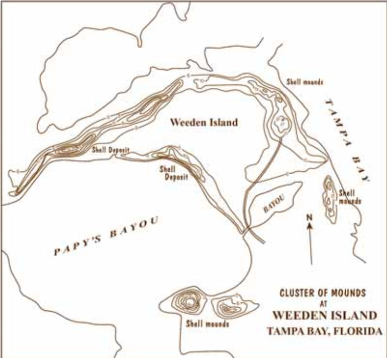

#Weedon Island and Remote Sensing

###More Than Mapping: How Can Remote Sensing Be Useful To Archaeologists?

Archaeologists use many different kinds of tools to 'dig' up the past. Beyond excavation, or laboratory analysis, there are other tools available that help answer questions about the past or study historic or prehistoric sites. Remote Sensing is one such technique that helps investigate sites.

What is Remote Sensing?


```markdown
remote sensing
noun
1. the use of an instrument, such as a radar device or camera, to scan the earth 
or another planet from space in order to collect data about some aspect of it

# Header 1
## Header 2
### Header 3

- Bulleted
- List

1. Numbered
2. List

**Bold** and _Italic_ and `Code` text

[Link](url) and 
```
Weedon Island is a Natural, Archaeological, and Historical Preserve Site


- prehistoric shell mounds and village site
- historic homesteads
- historic airfield
- interpretive museum


Where is Weedon Island?

 [Map](page3.html) 

What is Remote Sensing?


```markdown
remote sensing
noun
1. the use of an instrument, such as a radar device or camera, to scan the earth 
or another planet from space in order to collect data about some aspect of it

# Header 1
## Header 2
### Header 3

- Bulleted
- List

1. Numbered
2. List

**Bold** and _Italic_ and `Code` text

[Link](url) and 
```
How has Weedon Island changed over time?

In 1924, archaeologists from the Smithsonian mapped and excavated prehistoric shell mounds on the island.



In 1943, the U.S. Department of Agriculture collected aerial imagry.


Can you spot 
### Jekyll Themes

Your Pages site will use the layout and styles from the Jekyll theme you have selected in your [repository settings](https://github.com/jelane7/school/settings). The name of this theme is saved in the Jekyll `_config.yml` configuration file.

### Support or Contact

Having trouble with Pages? Check out our [documentation](https://help.github.com/categories/github-pages-basics/) or [contact support](https://github.com/contact) and we’ll help you sort it out.
