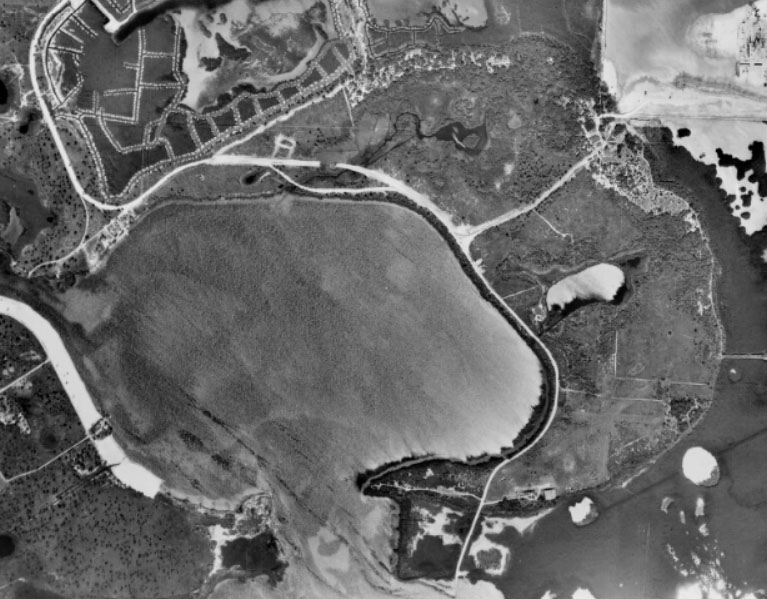
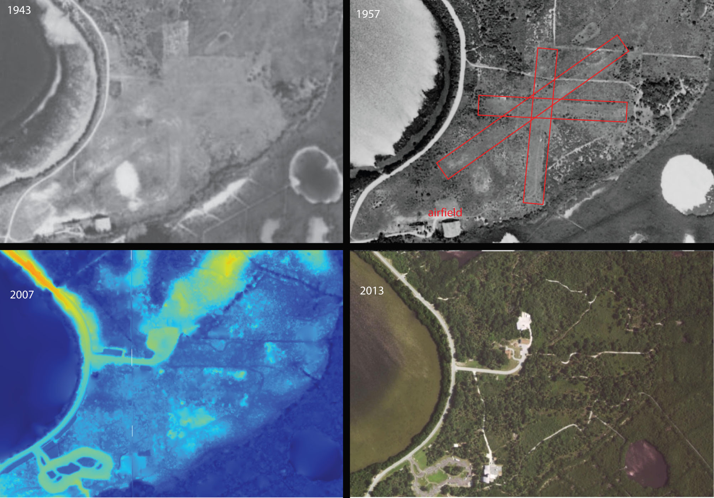

**Weedon Island and Remote Sensing**

How Can Remote Sensing Be Useful To Archaeologists?

Archaeologists use many different kinds of tools to 'dig' up the past. Beyond excavation, or laboratory analysis, there are other investigation techniques available that help answer questions about the past or study historic or prehistoric sites. Remote Sensing is one such technique that can be used to investigate archaeological sites. Let's look at Weedon Island in Florida and see what information Remote Sensing data might reveal about the past.

**What is Remote Sensing?**

*Remote Sensing*

(noun)

1. the use of an instrument, such as a radar device or camera, to scan the earth 
or another planet from space in order to collect data about some aspect of it

*What are some examples of Remotely Sensed Data?*
- Aerial Photography
- Light Detecting and Ranging (Lidar)
- Radio Detecting and Ranging (Radar)
- Hyperspectral Imagery
- Thermal Imagery 

**Where is Weedon Island?**
<iframe src="https://www.google.com/maps/embed?pb=!1m10!1m8!1m3!1d14110.409703360427!2d-82.61622868146688!3d27.852759065637784!3m2!1i1024!2i768!4f13.1!5e0!3m2!1sen!2sus!4v1487458821976" width="600" height="450" frameborder="0" style="border:0" allowfullscreen></iframe>
 [Map Link](page3.html) 
 
Weedon Island is a Natural, Archaeological, and Historical Preserve Site.
This photograph from about 1923 shows Dr. Weedon, an early historic resident of the island, near one of the prehistoric shell mounds ([photo from State of Florida Archivies, Florida Memory project](https://www.floridamemory.com/items/show/152491))

Types of cultural resources present on the island include:
- prehistoric shell mounds and village site
- historic homesteads
- historic airfield
- interpretive museum

In 1924, archaeologists from the Smithsonian Institute mapped and excavated prehistoric shell mounds on the island ([map from State of Florida, Archives, Florida Memory project](https://www.floridamemory.com/items/show/31951))

**What Remote Sensing data is available for Weedon Island?**

Aerial Photographs from the 1940s to the present are available for Florida

In 1943, the U.S. Department of Agriculture collected this aerial photograph [link](http://ufdc.ufl.edu/UF00071777/00004):

In 1957, the U.S. Department of Agriculture took additional aerial photographs [link](http://ufdc.ufl.edu/UF00071777/00009):

Lidar data, which was collected from aerial laser scanning of the ground surface, is available from the NOAA Office of Coastal Management. This data can be used to develop a Digital Elevation Model (DEM) showing the topography and features of the island. On this particular elevation model, areas of higher elevation show up in red, sloping down to yellow, while the blue color depicts lower, water level, elevations.

Can you spot modern additions to the island? What about the shell mounds, are they still present?

How has Weedon Island changed over time?

The Grand Central Airport, later called Sky Harbor, was constructed on the island in 1929 and served Eastern Airlines. It operated through World War II. The airfield  has long since closed, but can you find out where it was from the 1943 or 1957 aerial image?

 

The DEM and a modern aerial image show a parking lot, visitor center, and museum near where the airport was, but the airfield is not readily visible. However, the older aerial images show features associated with the historic airfield.

 

What about the prehistoric sites at Weedon Island? Have the shell mounds changed over time? What might have happened to alter them?

When the island was developed for homesteads, material from the shell mounds was used to build up the road. The borrow area and road are evident on the Digital Elevation Model.

In 1955, the power plant came to Weedon Island. Can you see much alteration to the landscape?

Citations:
NOAA Digital Coastal Data Viewer
2007 FDEM Lidar: Southwest Florida
Southwest FL Water Management District, FL Division of Emergency Management, FL Fish and Wildlife Conservation Commission, FL Department of Environmental Protection [found here](https://coast.noaa.gov/dataviewer/#/)

Historical Aerial Photography of Florida, University of Florida Digital Collections [found here](http://ufdc.ufl.edu/aerials)

Historic Photographs, State Archives of Florida, Florida Memory Project [found here](https://www.floridamemory.com/items/show/152491)

Weedon Island Preserve [found here](http://www.weedonislandpreserve.org/)
