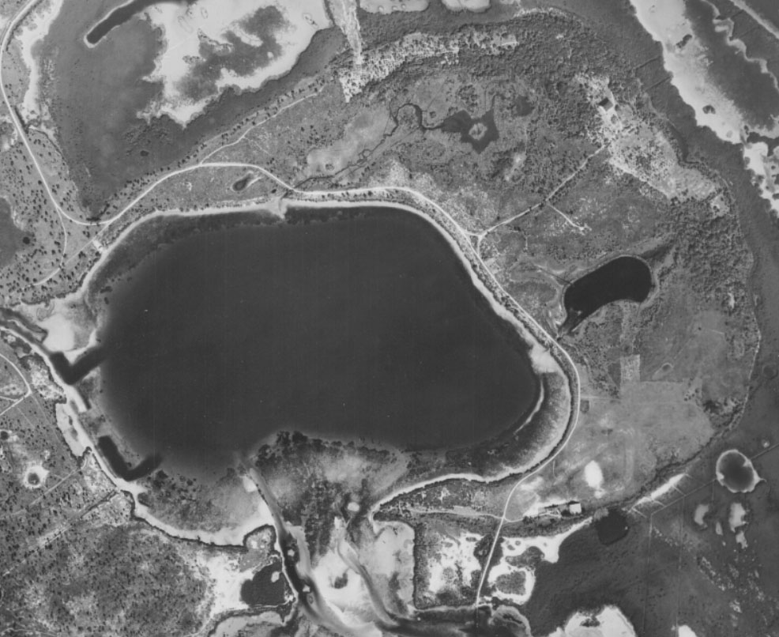

**Weedon Island and Remote Sensing**

How Can Remote Sensing Be Useful To Archaeologists?

Archaeologists use many different kinds of tools to 'dig' up the past. Beyond excavation, or laboratory analysis, there are other tools available that help answer questions about the past or study historic or prehistoric sites. Remote Sensing is one such technique that can be used to investigate archaeological sites. Let's look at Weedon Island in Florida and see what Archaeology can investigate with Remote Sensing data.

**What is Remote Sensing?**

*Remote Sensing*

(noun)

1. the use of an instrument, such as a radar device or camera, to scan the earth 
or another planet from space in order to collect data about some aspect of it

**Where is Weedon Island?**
<iframe src="https://www.google.com/maps/embed?pb=!1m14!1m12!1m3!1d8247.536730649881!2d-82.61079702536902!3d27.850854971763624!2m3!1f0!2f0!3f0!3m2!1i1024!2i768!4f13.1!5e1!3m2!1sen!2sus!4v1487448504256" width="600" height="450" frameborder="0" style="border:0" allowfullscreen></iframe>
 [Map Link](page3.html) 
 
Weedon Island is a Natural, Archaeological, and Historical Preserve Site (photo from State of Florida Archivies, Florida Memory project)

- prehistoric shell mounds and village site
- historic homesteads
- historic airfield
- interpretive museum

In 1924, archaeologists from the Smithsonian mapped and excavated prehistoric shell mounds on the island (map from State of Florida, Archives, Florida Memory project [(https://www.floridamemory.com/items/show/31951)])

**What Remote Sensing data is available for Weedon Island?**

Aerial Photographs from the 1940s to the present are available for Florida

In 1943, the U.S. Department of Agriculture collected aerial imagry:

Aerial image from 1957, aslo collected by the U.S. Department of Agriculture:

Lidar data, or aerial laser scanning of the ground surface, is available from the NOAA Office of Coastal Management. This data can be used to develop a Digital Elevation Model (DEM) showing the elevation, or topography, of the island. 

Can you spot modern additions to the island? What about the shell mounds, are they still present?

How has Weedon Island changed over time?

The airfield that was present on the island is no longer there, but can you spot it on the 1943 or 1957 aerial image?

 

Have the shell mounds changed over time? What could have happened?
     

When the island was developed for homesteads, material from the shell mounds was used to build up the road
Citations:
NOAA Digital Coastal Data Viewer
2007 FDEM Lidar: Southwest Florida
Southwest FL Water Management District, FL Division of Emergency Management, FL Fish and Wildlife Conservation Commission, FL Department of Environmental Protection [found here](https://coast.noaa.gov/dataviewer/#/)

Historical Aerial Photography of Florida, University of Florida Digital Collections [found here](http://ufdc.ufl.edu/aerials)

Historic Photographs, State Archives of Florida, Florida Memory Project [found here](https://www.floridamemory.com/items/show/152491)

Weedon Island Preserve [found here](http://www.weedonislandpreserve.org/)
